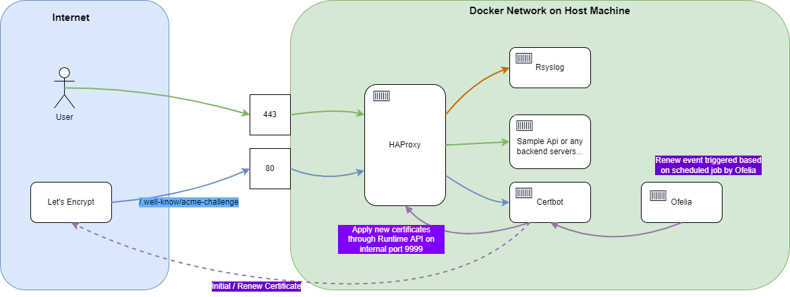

# Introduction

You may use this repository to set up the HAProxy with Let's Encrypt automatic renewal capability, rsyslog enabled with just two scripts. All you need is to have Docker and Docker Compose installed, ports opened, and nothing else. No cron job on the host machine, clean and tidy. Plus, it runs the HAProxy with the new non-root (2.4.0+) image which improves the security.

# How does it work?

The following diagram shows the whole picture of containers and the workflows

# Usage

1. Configure the Domain's DNS to point to your server, and make sure the 80 (used for acme challenge) and 443 ports are opened on your server.
2. Ensure you have Docker and Docker Compose installed. If not you may use [this repository](https://github.com/jinweijie/install-docker-and-compose) to install Docker and Docker Compose with just one command.
3. Clone this repository `git clone https://github.com/jinweijie/haproxy-le.git` and `cd haproxy-le`.
4. Run `bash init.sh`. It will ask your `domain name` and `email`, then use the `docker-compose-init.yml` and `haproxy-init/haproxy.cfg` to apply for the Let's Encrypt certificate for the first time. It takes several seconds to finish the whole process so please be patient until it finishes. Logs are available in the `certbot_log` volume in case something goes wrong.
5. Run `bash start.sh` to start the whole environment. It will start the rsyslog container for logging and Ofelia container to renew the certificate automatically and rotate the rsyslog log. A sample API will also be started for you to test the environment. You may replace the sample API with your actual services.

## Donate

If you would like to support my development, feel free to buy me a coffee, it makes a big difference! Thanks.

